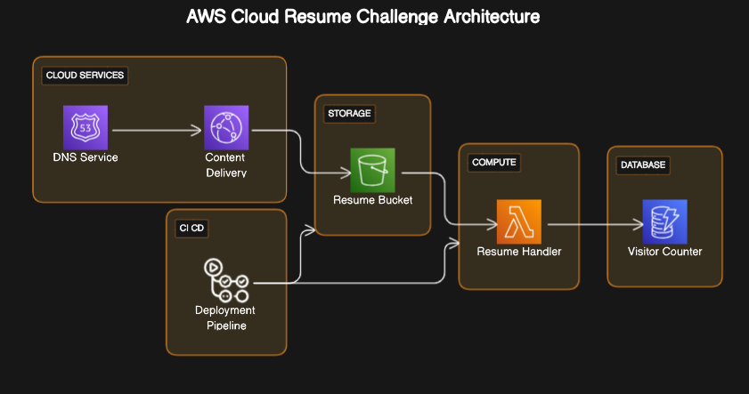
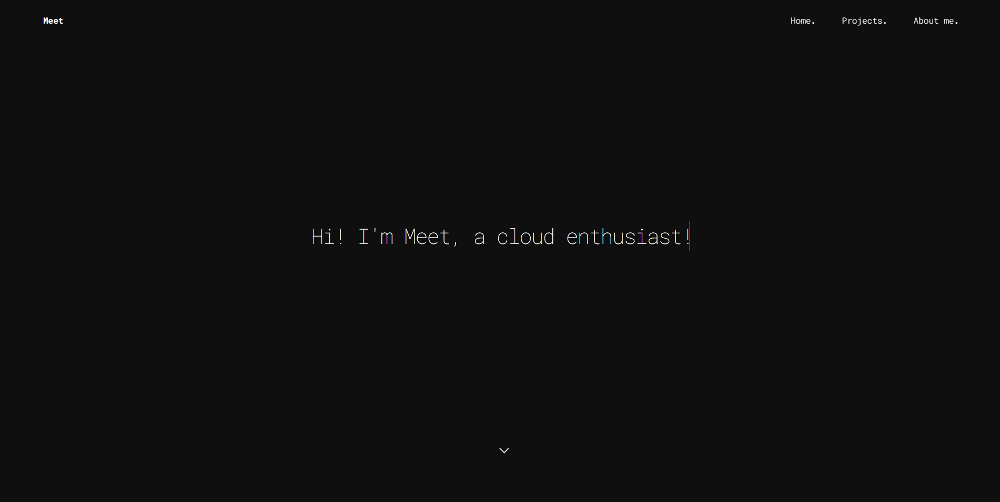

# Cloud Resume Project Overview

Hi, everyone! Here's my attempt at cloud resume challenge in AWS. The Cloud Resume project is a hands-on, real-world assignment designed to showcase cloud skills and understanding by building and deploying a personal resume as a static website on AWS. Thee project was introduced by Forrest Brazeal. Checkout the webbsite: [Cloud Resume Challange](https://cloudresumechallenge.dev/)

 <a href="https://www.meetrajput.com">https://www.meetrajput.com</a>

# Steps

Follow below steps in order to deploy your own resume website on AWS and explore how core services works together.

**1. [Get & Edit the Resume/Portfolio Website Template](Steps/website.md)** 
 
**2. [Amazon S3](Steps/S3.md)**
 
**3. [CloudFront Distribution](Steps/Cloudfront.md)**

**4. [AWS Certificate Manager](Steps/ACM.md)**

**5. [Amazon DynamoDB](Steps/DynamoDB.md)**

**6. [Amazon Lambda](Steps/Lambda.md)**

**7. [JavaScript and HTML](Steps/JsHtml.md)**

**8. [Gihub Actions](Steps/GithubActions.md)**

**9. [Terraform](Steps/Terraform.md)**

# Project Summary
The Cloud Resume project is a testament to the practical application of cloud services and DevOps practices. It demonstrates the ability to create a secure, scalable, and highly available website on AWS, with an automated deployment pipeline that integrates various AWS services and tools. The project not only serves as a personal online resume but also as a portfolio piece that illustrates the developer's cloud engineering skills.