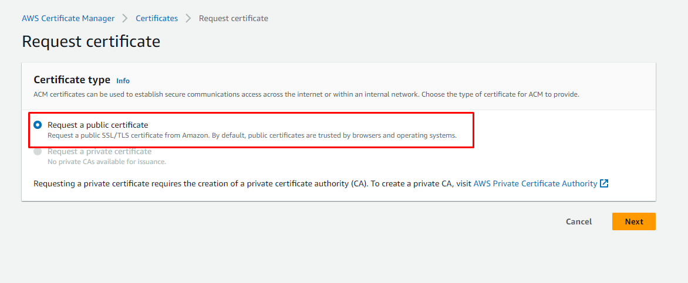
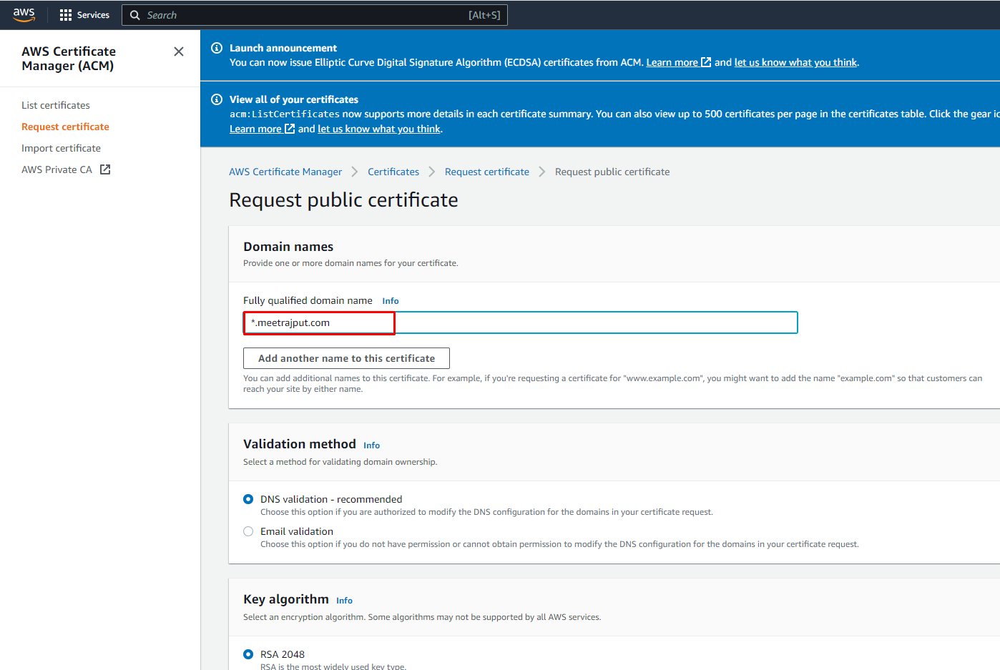
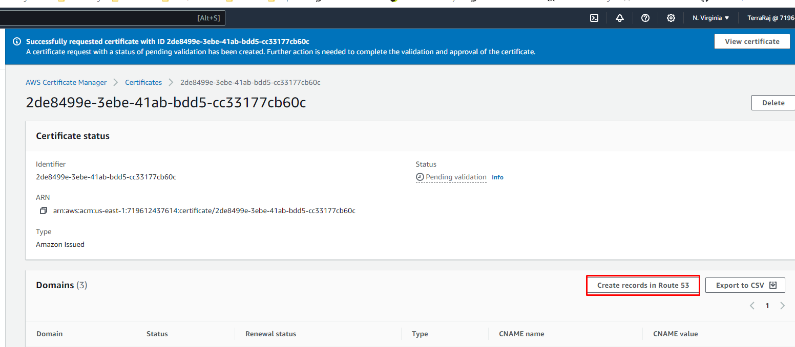
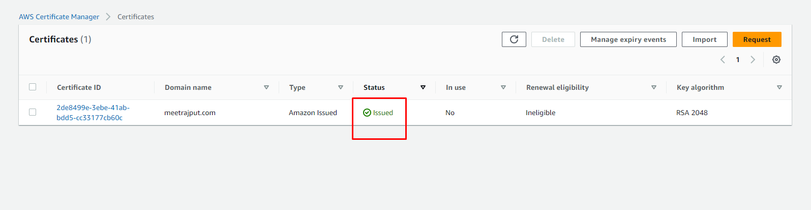

## AWS Certificate Manager (ACM)

AWS Certificate Manager (ACM) is a service that simplifies the management and deployment of SSL/TLS certificates for securing network communications and establishing the identity of AWS-hosted websites and applications. 

Follow below steps to attach public SSL/TLS certificate for our resume website:

## 1. Request a public certificate

Select the option of requesting a public SSL/TLS certificate and click on the Next button

## 2. Adding a domain name

Provide your fully qualified doamin name. Specify * option before your domain name if you want to use the same certificate for mulitiple records of your website. Leave the rest of the settings as they are and hit the Request button.

## 3. Adding record in Route53

Select the created cerificate and click on the Create record in Route 53. Follow the further instructions and add record in Route 53.

## 4. Issued Status

Make sure you get the Issued status for your certificate.

