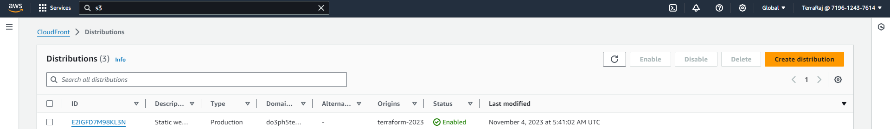
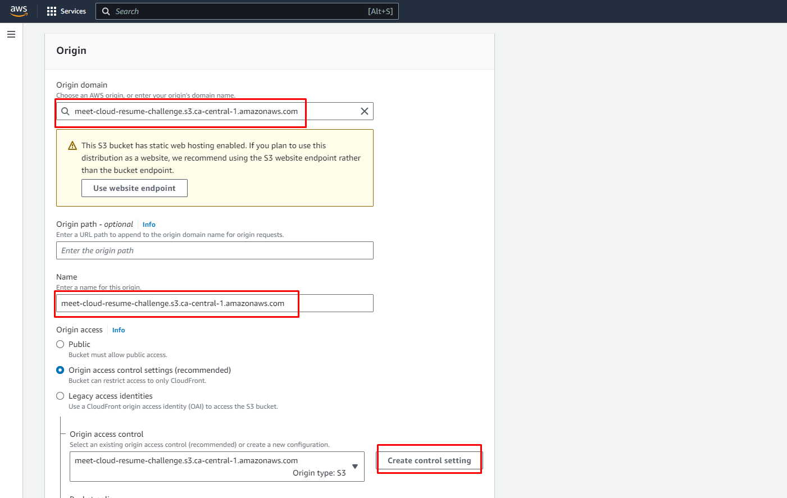
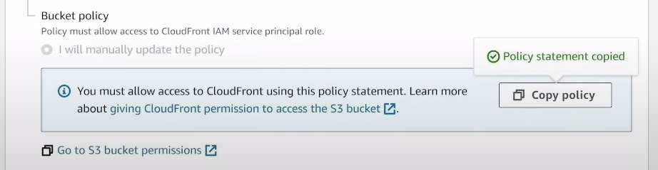
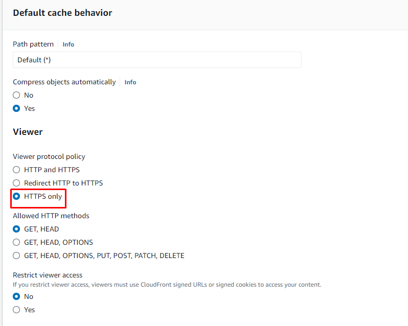
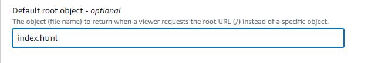
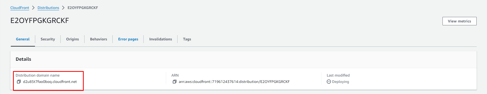
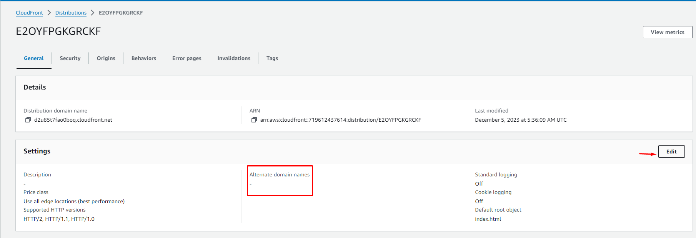
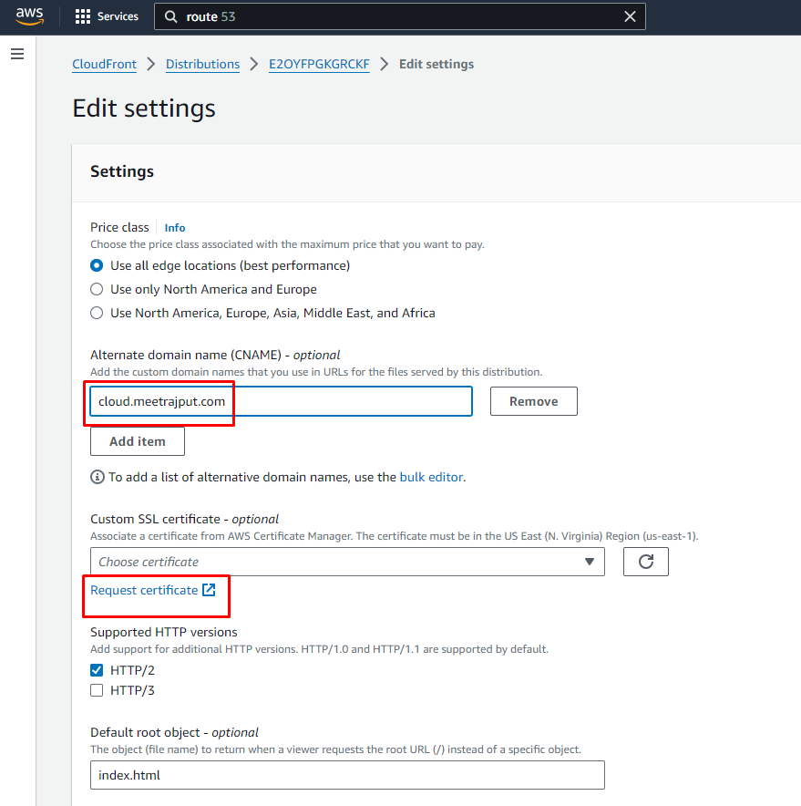
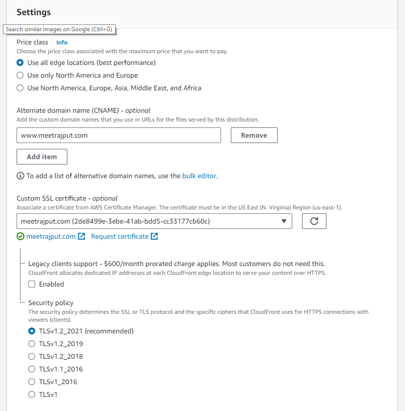

## AWS CloudFront

A content delivery network (CDN) service that distributed the website content globally. CloudFront ensures faster delivery of the website to users by caching content at edge locations closer to the end-users.
Amazon Certificate Manager (ACM): Provided SSL/TLS certificates to secure the website with HTTPS, ensuring encrypted data transfer between the website and its visitors. 

Follow below steps to setup your cloudfront distribution:

## 1. Create Distribution

Go to Cloudfront, create the distribution by selecting the option. 

 

Select the your S3 bucket as the Origin Domain, and select the Origin access control settings (recommended) option as shown in the screenshot.

## 2. Copy Policy to the S3 Bucket 

Copy policy and go to your S3 bucket.

## 3. Enable HTTPS only

By selecting the HTTPS option as name suggest, out website will serve on only HTTPS protocol.

## 4. Default Root Object

Leave rest of the option as it is and create the Cloudfront distribution. Lastlu, do mention your index.html file as a default root object so that it will load up the index.html first. You can enable it after creating the Cloudfront distribution as well. Just go to Settings and you should see this option.

## 5. Distribution URL

Once you create your Distribution, you should see the cloudfront distribution URL through which you could access your resume website.

*Note:* Go through [Route53](Route53.md) steps first and then come back to step 6.

## 6.  Alternate Domain Name

Click on the distribution, click on the Edit button to add Alternate Domain Name.

## 7. SSL/TLS Certificate

Provide your domain here, you can add any unused CNAME for your website. Apart from it, click on the Request Certificate option down below.

*Note:* Go through [ACM](ACM.md) steps first to get the public SSL/TLS certificate for our website and then come back to step 8.

## 8. Adding the certificate

Add the certificate, once it is created via ACM, leave the rest of the options they are, and hit the **Save Changes** button. 

If you now, open the website with your custom domain, it should load with the SSL/TLS certificate.

