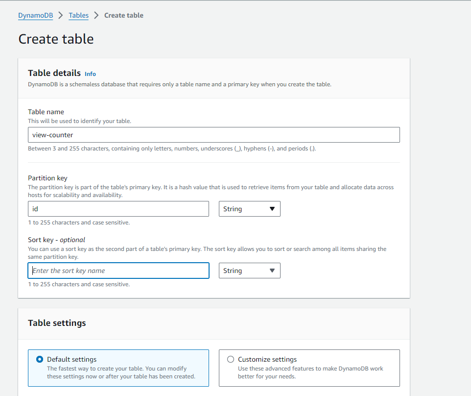
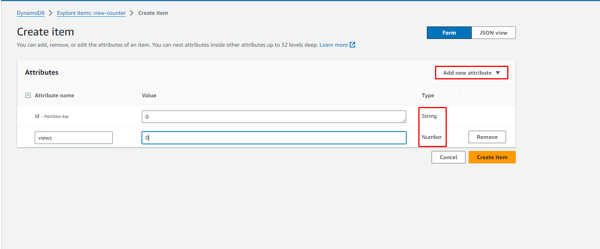

## Amazon DynamoDB

We have used a NoSQL database service called **Amazon Dyanmodb** to store and retrieve the visitor count data for the website. It provided a fast and flexible database solution for the visitor counter feature. Follow below steps to create the Table to store the visitor counts for our website.

## 1. Create Table

As shown in the screeshot, create the table with **id** as a Partition key and leave the rest of the setting to default.

## 2. Create items

Click on the table, go to the **Actions** button and select the **Explore items** option. Click on Create item, and **Add New Attribute** called **views**. Make sure the Type of views attribute is selected Number.

Now, you can move forward with the **AWS Lambda** step. 