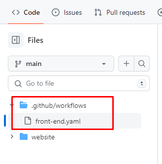
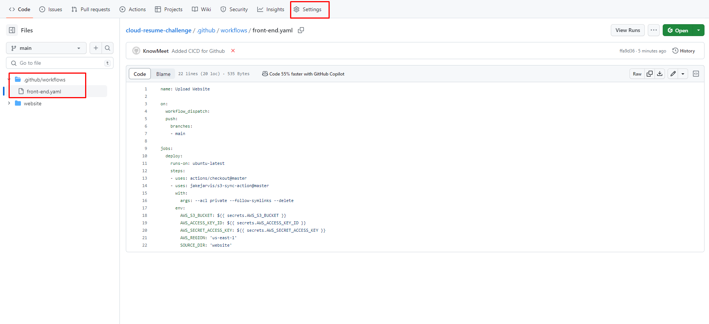
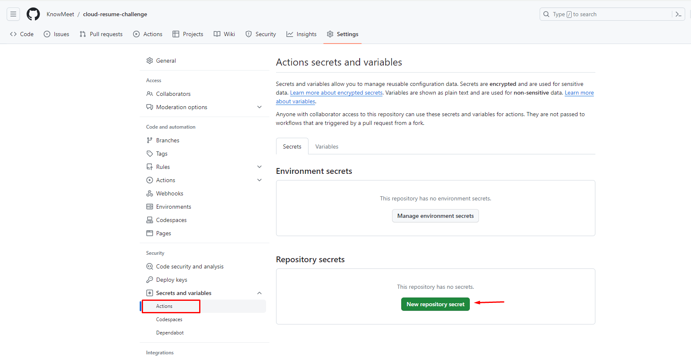
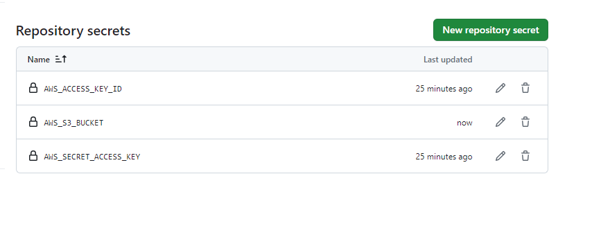
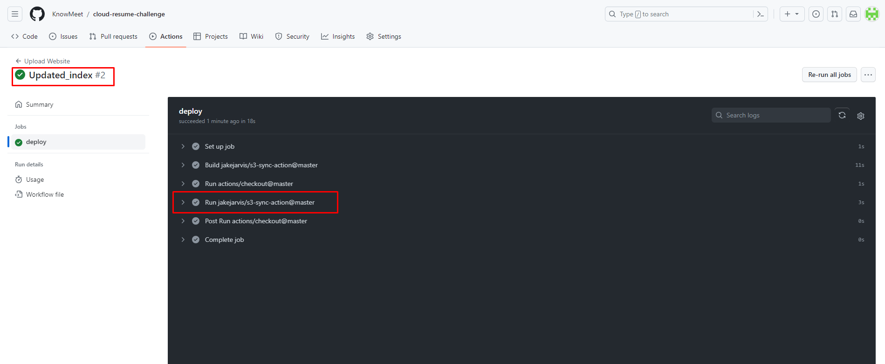

## Github Actions

We have enabled continuous integration and continuous deployment (CI/CD) by automating the deployment process. Whenever new code was pushed to the GitHub repository, GitHub Actions updated the S3 bucket with the latest website version. To follow these steps:

## 1. Add github workflows

We need to create [.github/workflows](/cloud-resume-challenge/.github/workflows/front-end.yaml) folders within our project so that we can define the actions that need to be taken for CI/CD in yaml file.



## 2. Create the yaml file

Create a yaml file, name it as per your choice and add the following code in it.

```yaml

name: Upload Website

on:
  workflow_dispatch:
  push:
    branches:
    - main

jobs:
  deploy:
    runs-on: ubuntu-latest
    steps:
    - uses: actions/checkout@master
    - uses: jakejarvis/s3-sync-action@master
      with:
        args: --acl private --follow-symlinks --delete
      env:
        AWS_S3_BUCKET: ${{ secrets.AWS_S3_BUCKET }}
        AWS_ACCESS_KEY_ID: ${{ secrets.AWS_ACCESS_KEY_ID }}
        AWS_SECRET_ACCESS_KEY: ${{ secrets.AWS_SECRET_ACCESS_KEY }}
        AWS_REGION: 'us-east-1' #Add your region
        SOURCE_DIR: 'website' #Add your website's folder name
```

## 3. Github repository Settings

Once you push these changes to your Github account, click on the **Settings** button.



## 4. Repository Secrets

Scroll down, Select the **Actions** options from **Secrets and variables** section and click on the **New repository secret** button. 



## 5. Adding the Secrets

Add the secrets for your AWS account so they are not visible publicly.



## 6. Deployment

Once you add all the necessary secret and push any changes to main/master branch, it will deploy the latest website changes automatically.

