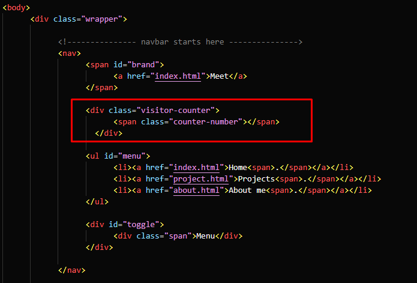

## Javascript and HTML

As per your website, we need to embed piece of code to the website so that it can display the Visitor Counter for our website. 

### Javascript

If you do not have **[index.js](/cloud-resume-challenge/website/index.js)** file for your website, create one and add the following piece of Javascript code. In the following code, we have created a element called **counter-number** which counts the number visitor via AWS Lambda URL. Make sure to add your own Lambda URL to this code.


```js
const counter = document.querySelector(".counter-number");
async function updateCounter() {
    let response = await fetch(
// Add your own Lambda URL
        "https://emquzx24mfy42dmnvi7jgbyxxu0jbjhl.lambda-url.us-east-1.on.aws/"
    );
    let data = await response.json();
    counter.innerHTML = `👀 Views: ${data}`;
}
updateCounter();

```

### HTML

Once you create the Javascript file or add this code to your existing index.js file, add HTML code for the Views in your **index.html** file. Make sure to add within **div** section of your **body** section of the website. Adjust its apperance as per your website.

