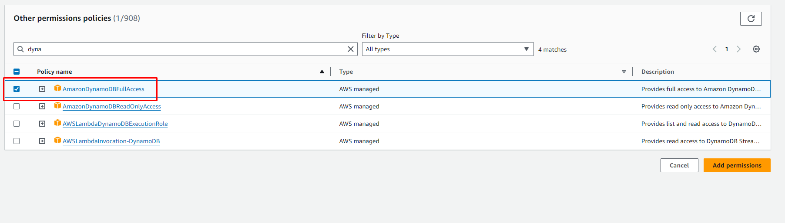

## AWS Lambda

We are going to use a serverless compute service called AWS Lambda that will run the backend code for the visitor counter feature without provisioning or managing servers. The code was written in Python and executed based on certain triggers. Follow these steps to execute this part:

## 1. Create Function

Visit AWS Lambda page, click on Functions>>Create Function and provide your function name. Select the Runtime as Python3.12 and Change defualt execution role as it is.


## 2. Advance Settings

As shown in the screenshot below, enable Function URL, Auth type as NONE and Configure CORS. This will allow access to your Function URL from any origin and hit the Create Function button.


## 3. Add the code

Add the below pyhton code to the code source. 

```py

import json
import boto3
dynamodb = boto3.resource('dynamodb')
# Add your own Dynamodb table name in parentheses
table = dynamodb.Table('view-counter') 
def lambda_handler(event, context):
    response = table.get_item(Key={
        'id':'0'
    })
    views = response['Item']['views']
    views = views + 1
    print(views)
    response = table.put_item(Item={
            'id':'0',
            'views': views
    })

    return views

```


*Note:* Make sure to add your own Dynamodb table name in parentheses

## 4. Confuguration Setting

Click on the Configuration tab, and select the Permissions options to see the Execution Role name.


## 5. Attach Policies to the Role

Go to the Role and as shown in the screenshot click on the Attach policy. 


## 6. Search and Add Policy

In the serach-bar, search for the permission called **AmazonDynamoDBFullAccess** and add it in the role.

