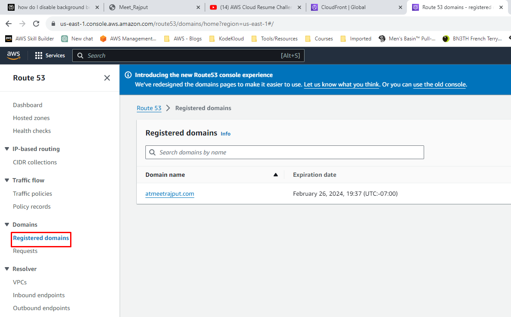
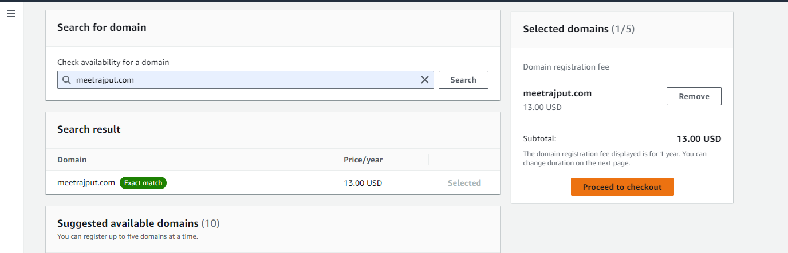
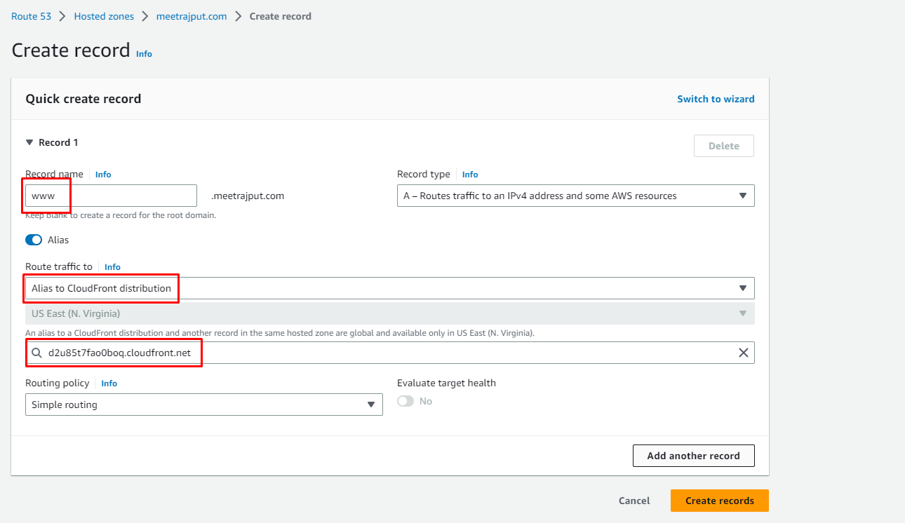

# Amazon Route53

We could map the Clodufront URL to the custom domain name via Route53. Amazon Route 53 is a cloud DNS service that connects user requests to internet applications and manages domain names. To achieve that follow below steps:

## 1. Visit Route53 service

Go to Route53 service and select Registered domains option from left side bar.

## 2. Buy Domain Name

Search for the Domain Name as per your preference and buy it. Follow the instructions, they are pretty straight forward.

## 3. Create record

Once your domain name is available to use, click on it and select the option Create record. See the screenshot below for your reference.

