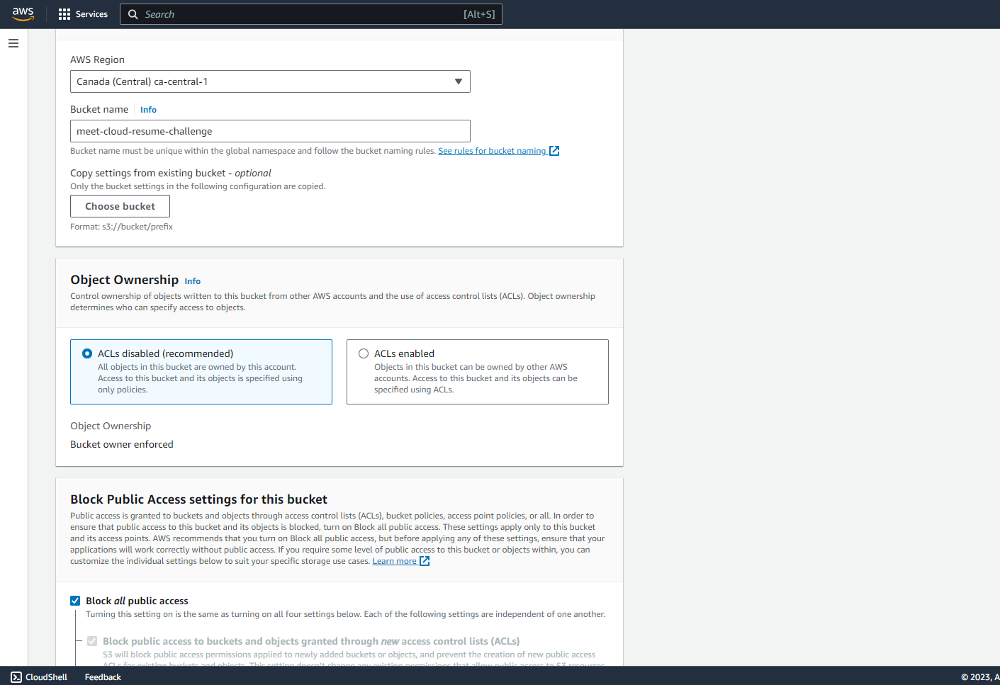
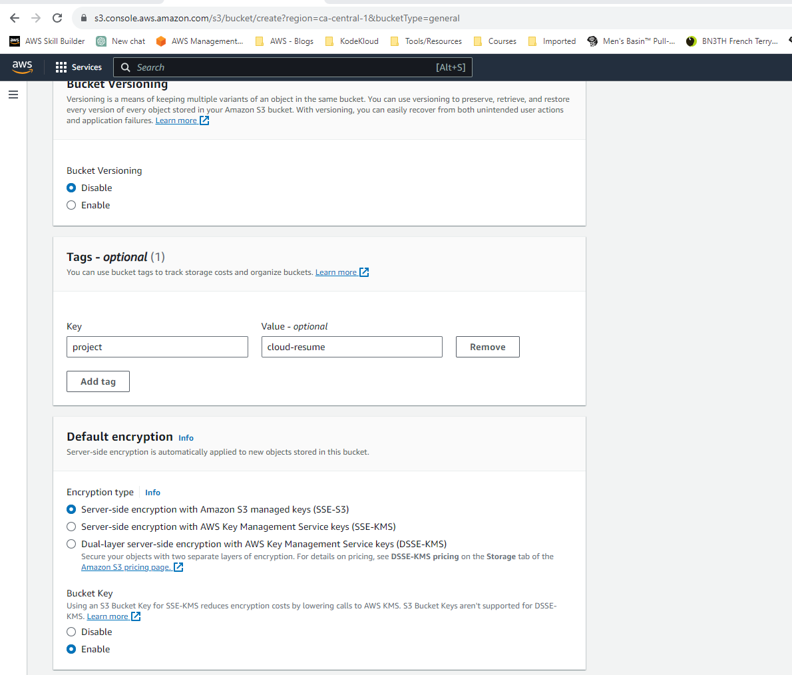
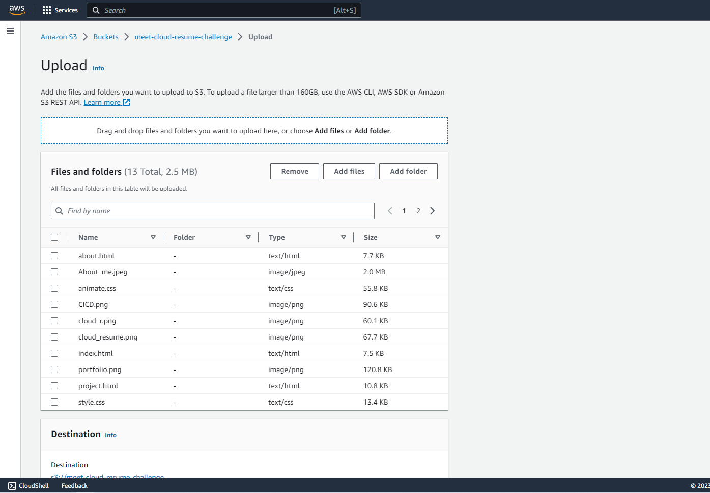
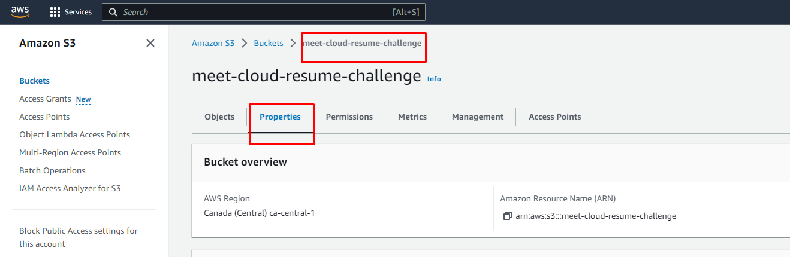
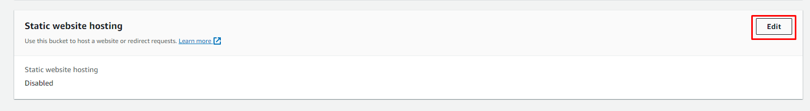
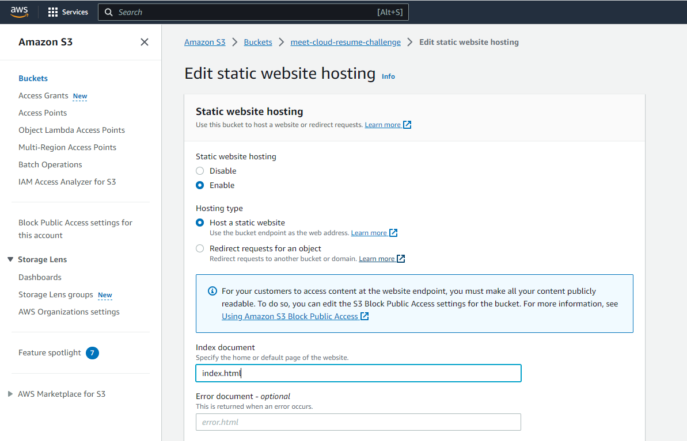
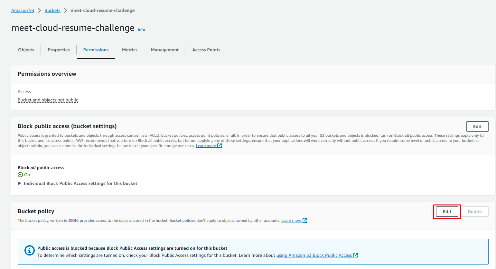
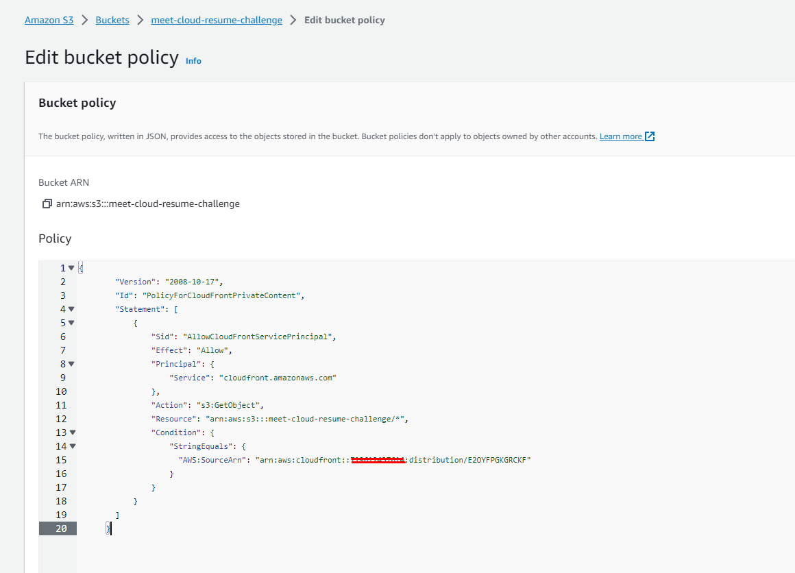

# Amazon S3 (Simple Storage Service) 

Used to host the static website content (HTML, CSS, JavaScript files). S3 provides a robust and secure way to store web assets with high availability and scalability. Follow below steps to setup your s3 bucket:

## 1. Create a bucket 

As shown in the screenshot below, make sure to Block all public access while creating your bucket. As name suggests, it will block the public access of your s3 bucket.

## 2. Other Setting

Do enable the SSE-S3 Encryption and Bucket Key options for the S3 bucket. 

## 3. Upload your static website content

Select the bucket, and upload all your supported files such as images, html, css, and javascript.

## 4. Enable Static Website hosting 

As shown in the images below, select properties option, scroll-down and select the Edit option of Static website hosting section.

## 5. Index document

Select the Enable option for your website and specify the index.html file.

*Note:* Go to [Cloudfront](Cloudfront.md) option first and then come back to step 6.

## 6. Bucket policy 

After you copied the policy from the cloudfront, select the Edit option of the bucket policy and paste the policy from Cloudfront distribution. This way it can access the website content. 

